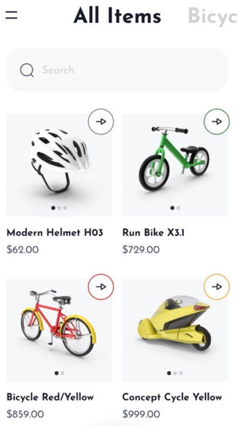
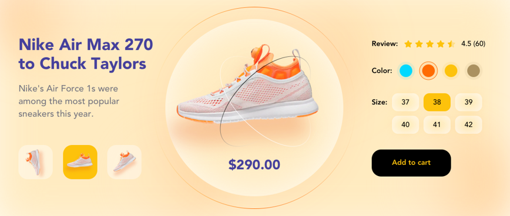

# 🎥 Nova-mart Full-Stack Project

This is a full-featured, fully functional application developed for the nova-mart chain of stores.
Integration with the YooKassa payment system is available.

## 💻 Tech Stack & Architecture

This project is built using the following technologies:

| **Service** | **Location** | **Technology Used** | **Key Libraries / Frameworks** |
| :--- | :--- | :--- | :--- |
| **Frontend** | `client-side/` | **Next.js** (React) | Axios, Redux-persist/toolkit, Tailwind CSS |
| **Backend** | `server-side/` | **NestJS** (Node.js/TypeScript) | NestJS/JWT, Prisma, Typegoose, Argon2 |

